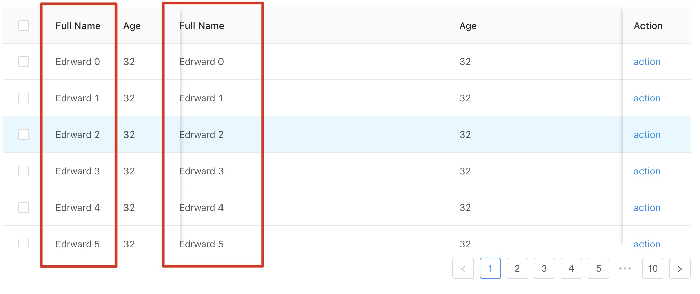

This project was bootstrapped with [Create React App](https://github.com/facebook/create-react-app).

# 本项目使用 [yarn](https://yarn.bootcss.com/) 管理依赖包

## 步骤

    pull项目后

    yarn install 运行安装依赖包
    进入项目根目录
    yarn start 即可运行
    yarn run build 打包

## 项目依赖

    react
    react-router-dom
    axios
    antd

## 记录

    2018-12-02
    修改 antd 的表格，建立了模块化，也发现了一个 antd 的bug，固定列的时候，如果列数很少，固定的列会遮不住表格中应有的列,如下图：

